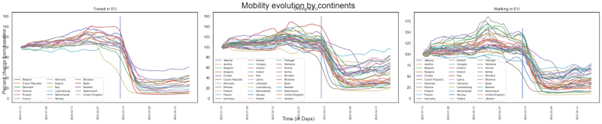

# Are we facing a climate change awareness pandemic ?

##   How did the covid crisis impact people's lifestyle, mobility and localization ?

As expected, the effect of the pandemic on the mobility were drastic, and starting around early March, the transit, driving and walking time dramatically deceased to around ~30% compared to the baseline. Already though, we see quite some discrepancy between countries.

Now, these results are smoothed on a weekly basis, and in fact all mobility behavior were previously highly influenced by a weekly pattern.

